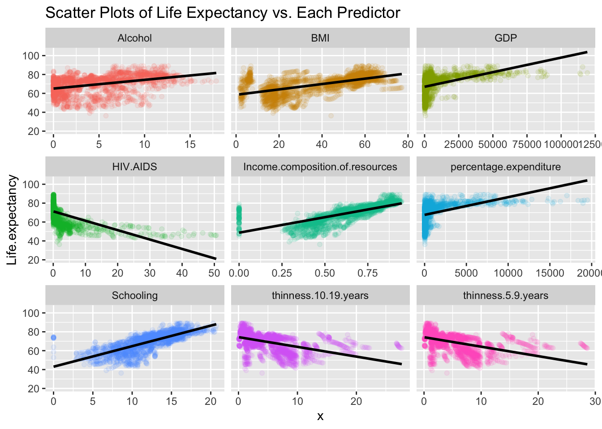

# life-expectancy-analysis
Group project for STAT 4355 - Applied Linear Models at UT Dallas

**Team Members:** [Prachi Patel](https://github.com/Prachip1912), [Evan Meade](https://github.com/Evan-Meade), [Alejandro De La Cruz](https://github.com/AlejandroDeLaCruz)

**For full results, see `Report.pdf`. For a visual summary, see `Presentation.pdf`.**

## Motivation

This dataset containing **2,938 observations** of **22 variables** is about the life expectancy in different countries. The dataset has gathered information from **193 countries**, which has been collected from the World Health Organization (WHO) data repository website, who keep track of health status and many other factors for all countries. Our goal with this project is to investigate the key factors that help improve a countries’ overall life expectancy. We want to find out what happens to the life expectancy in a country when certain statuses change. For instance, if the amount of schooling a person gets in a country increases or decreases, how will that affect the life expectancy in the country? By understanding why a certain country has a high or low life expectancy, we can figure out how to improve life for them using the information found.

## Data

Though this data was originally collected by WHO and the United Nations (UN), we sourced it from [Kaggle](https://www.kaggle.com/kumarajarshi/life-expectancy-who). This was done for convenience, as a user had already downloaded and combined the data into a convenient `.csv` form. As a result, we will have more time for analysis as we will be spending less time hunting data.

As stated in the goal, this dataset contains 2,938 observations of 22 variables. The data contains large spatial and temporal baselines; it includes observations of **193 countries ranging from 2000-2015**. Each country is additionally classified as “developed” or “developing,” providing opportunity for comparative analysis of these two groups. While not all (country, year) pairs have complete data, approximately half of them do, and many more have partially complete data. This allows us to assess the effects of time and place on life expectancy.

The main content of the dataset is a collection of health and economic indicators that measure societal factors which are potentially relevant to predicting life expectancy. The health factors include mortality rates (adult, children, infant, etc.), disease rates (HIV/AIDS, polio, measles, etc.), and national medical averages (life expectancy, BMI, alcohol consumption, etc.). Together, these figures provide a snapshot of the leading ailments in a country and the average person’s health. Meanwhile, the economic factors track GDP, government health expenditures, and population, as well as average income and education levels. These factors give insights into the resources available to the government as well as the average citizen to face the medical ailments captured by the health indicators. So, taken altogether, this dataset provides a coarse view of the resources invested by countries to address public health issues. As such, by analyzing it, we can assess what resources/ailments have the highest impact on life expectancies.

## Summary of Methods

To guide our analysis, we developed the following questions we wished to explore. Some were inspired by the suggested questions provided by the dataset (linked above). Others were entirely developed by us. These questions employ a variety of concepts, including variable selection, residual analysis, influence analysis, prediction intervals, and general linear hypothesis testing. To see the full analysis and methods behind each question, refer to `Report.pdf`.

Questions answered in analysis:

1. Which predictors are most correlated with life expectancy? **ALL**
1. Is there a linear relationship between any of the predictors and life expectancy? Or is there some nonlinear relationship at play? **ALL**
1. Given these predictors, how accurately can one predict life expectancy with a linear model? **Alejandro**
1. Have the impacts of predictors changed over time or remained constant? (eg. was adult mortality always highly correlated with life expectancy, or is that a recent development?) **Evan**
1. Which countries over- or under-perform in life expectancy relative to what our linear model would predict? What might account for this difference? **Evan**
1. Are any of the predictors correlated with each other? If so, can the dimensionality of the dataset be reduced while retaining predictive power? **Alejandro**
1. To improve the lifespan of a country with low life expectancy(<65), should they improve on their healthcare expenditure? (inspired by suggested question #2) **Prachi**
1. In a developing country, what should they do to increase life expectancy versus a developed country? **Prachi**

## Conclusions

To conclude, we answered our main goal which is to investigate the key factors that help improve a country’s overall life expectancy. When we constructed our linear model from the 7 selected variables derived from the 10 original variables selected, we found that overall countries can improve on certain factors such as schooling, GDP, alcohol consumption, income composition of resources, and cases of HIV/AIDS. From the reduced model, we have found great results with an $R^2$ value of 78.28% which is a decently good model since we assume that the model isn’t being overfitted. As for residual analysis of the model, we mentioned how there weren't any non-linear relationships on the residual plot and the histogram of residual showed to be normally distributed, thus it is a reasonably good model. Even though it has a good $R^2$ score there is a bias occurring within the model since we have removed all instances of missing values which doesn’t give us the specifics of improving life expectancy. As previously mentioned in question 8, we have decided to separate the data into two models (developed and developing countries) since not all factors may apply for both country statuses. And based on our findings we found that there are a few commonalities in terms of key factors which were schooling, consumption of alcohol and income composition of resources which were common in the developed and developing countries. The key factors that both developed and developing countries should improve on is the body mass index, and health care expenditure. Essentially, depending on the country’s status those are the key factors that a country should focus on in order to improve their overall life expectancy.
